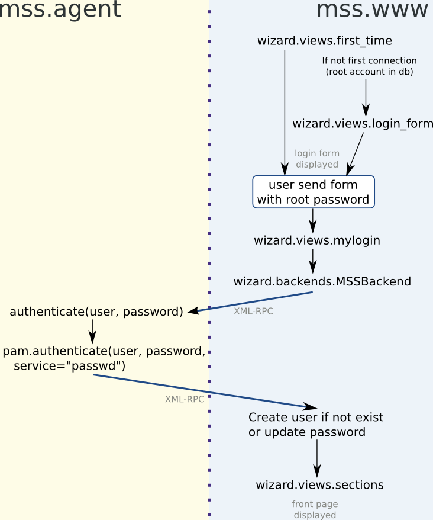
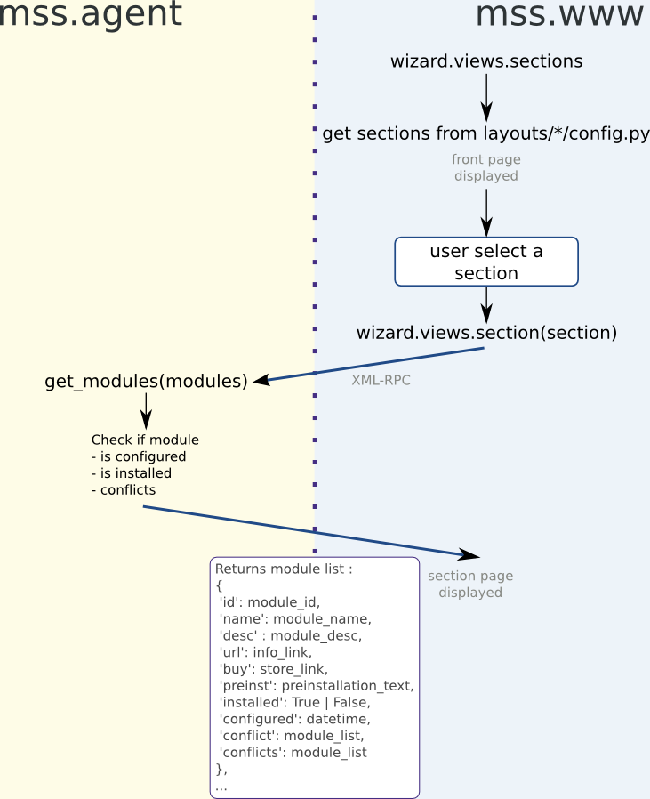
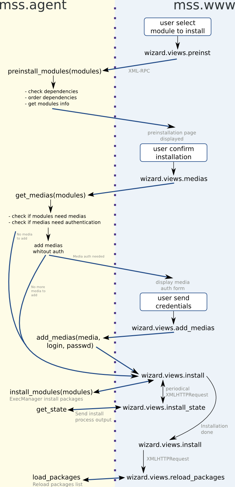

MSS architecture
=================================================

MSS is composed of two parts :

1. a XML-RPC agent which execute commands on the computers and manipulate the data. The agent is written in Python.
2. a webserver providing an interface to control the XML-RPC agent. The webserver is `cherrypy <http://www.cherrypy.org/>`_ and the interface is written with `Django <http://www.djangoproject.com>`_.

MSS XML-RPC agent (mss.agent python package)
-------------------------------------------------

The XML-RPC agent handles all the modules that can be installed through MSS. A module
is the description of a component you would like to install and configure in the MSS
interface.

A module is characterized by :

1. a name
2. a description
3. some pre-installation text
4. packages
5. medias to add in order to install the packages
6. dependencies
7. conflicts
8. configuration field and types
9. some python methods to get the current module configuration

Most of this information is written in an XML file. For example, this is the description of
the mysql module:

.. highlight:: xml

::

    <module id="mysql">
        <name>MySQL database</name>
        <desc>MySQL relational database</desc>
        <packages>
            <target name="all">
                <rpm>mysql</rpm>
                <rpm>mysql-client</rpm>
            </target>
        </packages>
        <conflicts>
            <module>mysqlmax</module>
        </conflicts>
        <config>
            <password name="current_mypasswd">
                <label>Current password</label>
                <help>Current MySQL root password. Leave blank for first installation.</help>
            </password>
            <password name="mypasswd" require="yes">
                <label>New password</label>
                <help>New MySQL root password. Set here the new password.</help>
            </password>
        </config>
    </module>
    
For mor detailled info check :doc:`module_description`

MSS web interface (mss.www python package)
-------------------------------------------------

The MSS web interface is served by the cherrypy webserver. Django is used on top of
cherrypy as it provides nice features for templating, url naming, internationalization,
authentication backends in a modular approach.

Authentication process
----------------------

Front page and section page render
----------------------------------

Module installation
----------------------------------

