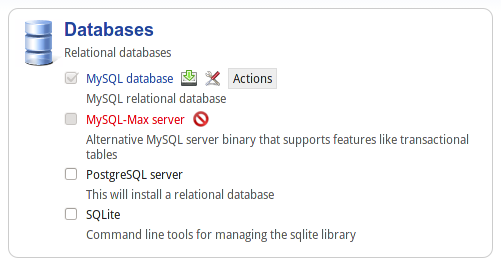

MSS layouts
===========

To organize the modules in the web interface MSS uses a layout system to display
the modules to the users.

A layout is composed of one or more sections which contains one or more bundle. 
A bundle contains one or more modules.

The layouts are python modules located in the :py:mod:`mss.www.layout` module.

Layout example
--------------

Directory structure :

::

    layout/
        my_layout/
            locale/
            config.py
            __init__.py

As the layout is a python module we need an ``__init__.py`` file. The configuration
of the layout is done in the ``config.py`` file.

The "Core Services" and "Other Services" sections are defined in the base
layout (``layout/base/config.py``). The markertplace section is defined in the
commercial layout (``layout/commercial/config.py``).

Section
^^^^^^^

A section is defined by :

* a unique id
* a name

In the ``config.py`` file import the :py:class:`mss.www.config.Config` class to
reference the section

::

    from django.utils.translation import ugettext as _
    from mss.www.wizard.config import ConfigManager

    config = ConfigManager()

    # add the section to the layout config
    config.add_section({
        'id' : 'my_section',
        'name' : _('My section'),
    })

The name and the description can be translated. We use the ``_`` shortcut for
gettext translations.

All sections are listed at the left of the screen.

Bundles
^^^^^^^

A bundle is defined by :

* a unique id
* a name
* an icon (optionnal)
* a list of modules

::

    config.add_bundle("core", {
        'id': 'mail',
        'name': _('Mail'),
        'icon': 'base/mail.png',
        'modules': ["mail", "webmail"]
    })

This will output something like this in the section page :

In this example, the bundle is composed of 2 modules.

Modules
^^^^^^^

A module is defined by :

* a unique id

::

    config.add_module("my_section", "my_bundle", "module_id")

This method allows you to add a specific module in any bundle of any section.
