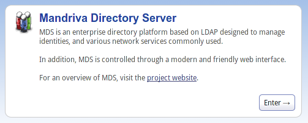
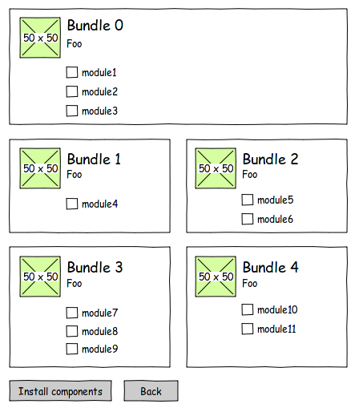

MSS layouts
=================================

To organize the modules in the web interface MSS uses a layout system to display
the modules to the users.

A layout is composed of one or more sections which contains one or more bundle. All
sections are displayed on the front page. A bundle contains one or more modules.

The layouts are python modules located in the :py:mod:`mss.www.layout` module.

Layout example
---------------

Directory structure :

::

    layout/
        my_layout/
            locale/
            config.py
            __init__.py

As the layout is a python module we need an ``__init__.py`` file. The configuration
of the layout is done in the ``config.py`` file.

Section
^^^^^^^

A section is defined by :

* a unique id
* a name
* an icon
* a description text
* some presentation related stuff

In the ``config.py`` file import the :py:class:`mss.www.config.Config` class to
reference the section

::

    from django.utils.translation import ugettext as _
    from mss.www.wizard.config import ConfigManager

    config = ConfigManager()

    # example of section defenition
    my_section = {
        'id' : 'my_section',
        'name' : _('My section'),
        'icon' : 'my_section_icon.png',
        'desc' : _('This is a new section !'),
        'conf' : { 'class': 'block-1' },
    }

    # add the section to the layout config
    config.add_section(my_section)

The name and the description can be translated. We use the ``_`` shortcut for
gettext translations.

This will output something like this on the front page :

Bundles
^^^^^^^

A bundle is defined by :

* a unique id
* a name
* an icon
* a description text
* some presentation related stuff
* a list of modules

::

    my_bundle =
        {
            'id': 'mybundle',
            'name': _('My Bundle'),
            'icon': 'bundle_1.png',
            'desc': _('Foo'),
            'conf': {'class': 'block-1'},
            'modules': ["module1", "module2", "module3"],
        }

    config.add_bundle("my_section", my_bundle)

This will output something like this in the section page :

.. image:: media/bundle_example.png

In this example, the bundle is composed of 4 modules related to databases.
The first module is already installed on the system and was configured by MSS.
The second module conflicts with some module installed.

Modules
^^^^^^^

A module is defined by :

* a unique id

::

    config.add_module("my_section", "my_bundle", "module_id")

This method allows you to add a specific module in any bundle of any section.

Presentation
------------

On the front page and the section pages the sections and bundles can be organized
in a one or two column way.

To display a block (section or bundle) in one column use the ``block-1`` class :

::

    'conf' : { 'class': 'block-1' },

To have two columns, blocks must use the ``block-2`` class :

::

    'conf' : { 'class': 'block-2' },

When using a 2 column layout the first block of each "row" must use the ``block-clear`` class :

::

        {
            'id': '0',
            'name': _('Bundle 0'),
            'icon': 'bundle_0.png',
            'desc': _('Foo'),
            'conf': {'class': 'block-1'},
            'modules': ["module1", "module2", "module3"],
        },
        {
            'id': '1',
            'name': _('Bundle 1'),
            'icon': 'bundle_1.png',
            'desc': _('Foo'),
            'conf': {'class': 'block-clear block-2'},
            'modules': ["module4"],
        },
        {
            'id': '2',
            'name': _('Bundle 2'),
            'icon': 'bundle_2.png',
            'desc': _('Foo'),
            'conf': {'class': 'block-2'},
            'modules': ["module5", "module6"],
        },
                {
            'id': '3',
            'name': _('Bundle 3'),
            'icon': 'bundle_3.png',
            'desc': _('Foo'),
            'conf': {'class': 'block-clear block-2'},
            'modules': ["module7", "module8", "module9"],
        },
        {
            'id': '4',
            'name': _('Bundle 4'),
            'icon': 'bundle_4.png',
            'desc': _('Foo'),
            'conf': {'class': 'block-clear block-2'},
            'modules': ["module10", "module11"],
        },

This configuration will render something like that :

